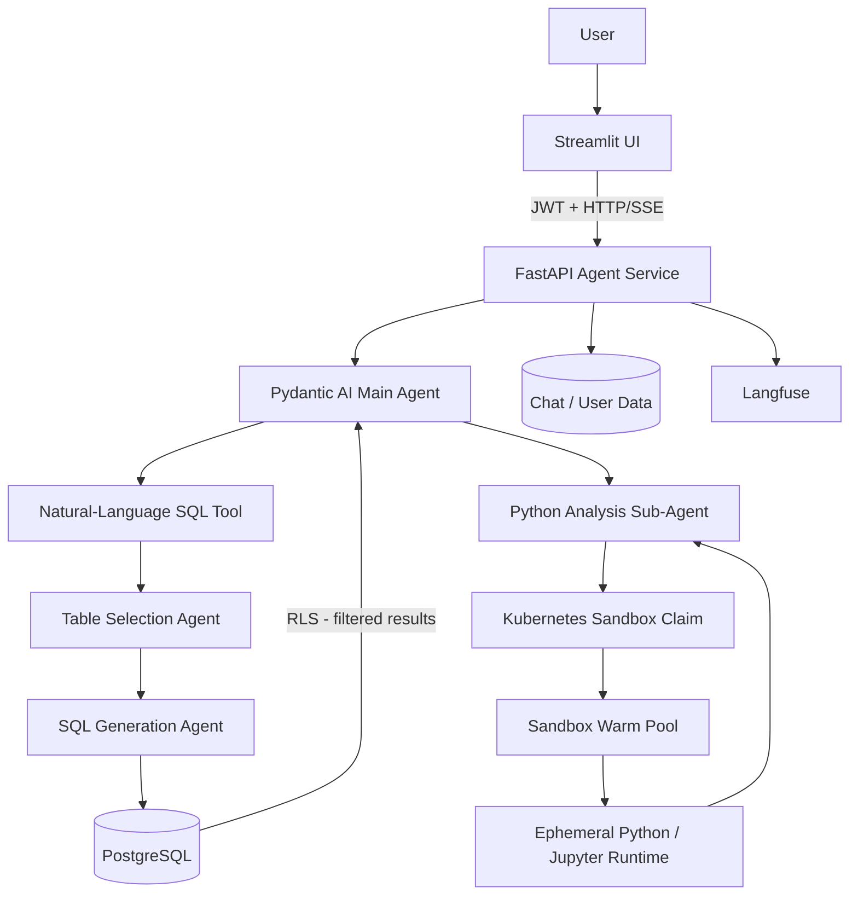

# Pydantic AI Analysis Agent

An experimental, full-stack AI analysis agent built with **Pydantic AI**, **FastAPI**, **PostgreSQL**, **Streamlit**,
and **Kubernetes Agent Sandbox**.

The project combines conversational AI with:

- natural-language querying over PostgreSQL data,
- LLM-generated read-only SQL,
- PostgreSQL Row-Level Security (RLS) for per-user data isolation,
- sandboxed Python execution for calculations and analysis,
- persistent multi-turn chat sessions,
- streaming responses,
- JWT-based authentication,
- Langfuse tracing and observability,
- and Kubernetes/Skaffold-based deployment.

> **Project status:** This repository is primarily a development/experimental project. The main deployable
> implementation lives under `services/`, while the Python files at the repository root are earlier/local experimentation
> scripts.

---

## Architecture



At a high level, the main Pydantic AI agent decides whether a request needs database access, Python execution, or can be
answered directly.

For database questions, the workflow is:

```text
Natural-language question
        ↓
Relevant table selection
        ↓
PostgreSQL SELECT generation
        ↓
Query executed as current user
        ↓
PostgreSQL RLS filtering
        ↓
Result returned to the main agent
```

For Python-related tasks:

```text
User request
      ↓
Python sub-agent
      ↓
Kubernetes SandboxWarmPool
      ↓
Ephemeral Jupyter-like Python environment
      ↓
Execution result
      ↓
Final agent response
```

---

## Features

### Natural-language database analysis

The agent can answer questions against PostgreSQL data without requiring the user to write SQL.

The database tool uses two specialized Pydantic AI agents:

1. **Table Selection Agent** — determines the smallest set of tables required for the question.
2. **SQL Query Agent** — generates a PostgreSQL query using only the provided schemas and examples.

The SQL agent is instructed to generate **read-only `SELECT` queries** and not generate statements such as `INSERT`,
`UPDATE`, `DELETE`, `DROP`, `ALTER`, `CREATE`, or `TRUNCATE`.

The current demonstration schema includes:

- addresses
- products
- stores
- store/product inventory
- transactions
- transaction/product relationships

---

### PostgreSQL Row-Level Security

Database authorization is enforced at the PostgreSQL layer rather than relying solely on the LLM.

The application creates a short-lived database role for the authenticated user and executes generated SQL using that
role. PostgreSQL RLS policies then restrict transaction data to the appropriate user.

This keeps authorization separate from the SQL-generation prompt:

```text
LLM decides what data to query
             ↓
PostgreSQL decides what rows the user may access
```

---

### Sandboxed Python execution

For requests involving calculations, data analysis, code execution, debugging, or verification, the main agent can
delegate to a dedicated Python sub-agent.

Python code runs inside a Kubernetes sandbox obtained from the configured `SandboxWarmPool`.

Each Python-agent invocation gets a fresh sandbox workflow and the sandbox is terminated after the task completes.

The sandbox runtime provides a Jupyter-like Python environment with packages including:

- `pandas`
- `ipykernel`
- `jupyter-client`
- `httpx`

---

### Persistent conversations

Chat sessions and Pydantic AI message history are persisted in PostgreSQL.

When a conversation continues, the application restores the previous Pydantic AI messages and passes them back to the
agent.

Long conversations use tiered context compaction with:

- tool-result cleanup,
- conversation summarization,
- and retention of recent messages.

---

### Streaming responses

The FastAPI backend exposes an **SSE (Server-Sent Events)** endpoint for streaming assistant responses.

The Streamlit frontend consumes the SSE stream and updates the conversation incrementally.

---

### Authentication

The application supports:

- user registration,
- username/password login,
- Argon2 password hashing,
- JWT bearer tokens,
- authenticated chat sessions,
- and ownership validation for stored conversations.

Access tokens currently expire after **30 minutes**.

---

### Langfuse observability

Agent requests are instrumented with Langfuse.

Tracing metadata includes the authenticated user and chat session, making it possible to inspect agent runs and
multi-turn conversations through Langfuse.

---

## Repository Structure

```text
.
├── manifests/
│   ├── agent_app/              # FastAPI deployment, service, RBAC and config
│   ├── gateway/                # Kubernetes Gateway/API routing
│   ├── jupyter_sandbox/        # SandboxTemplate and SandboxWarmPool
│   └── langfuse/               # Langfuse Helm configuration/resources
│
├── services/
│   ├── agent_app/
│   │   ├── app/
│   │   │   ├── agents/         # Pydantic AI agents and tools
│   │   │   ├── api/            # Auth, user and chat routes
│   │   │   ├── auth/           # JWT/password utilities
│   │   │   ├── db/             # SQLAlchemy schema, RLS and DB utilities
│   │   │   ├── models/         # API/agent models
│   │   │   ├── services/       # Agent, session and user services
│   │   │   └── main.py         # FastAPI application
│   │   ├── Dockerfile
│   │   └── pyproject.toml
│   │
│   ├── sandbox_template_image/
│   │   ├── Dockerfile
│   │   ├── main.py             # Sandbox runtime API
│   │   └── requirements.txt
│   │
│   └── streamlit_app/
│       ├── app.py              # Chat frontend
│       ├── Dockerfile
│       └── requirements.txt
│
├── init_script.sh              # Install infrastructure dependencies
├── delete_script.sh            # Remove infrastructure dependencies
├── skaffold.yaml               # Build/deploy development stack
├── pyproject.toml
├── uv.lock
│
├── main.py                     # Experimental/local agent + DB code
├── main_2.py                   # Experimental Pydantic AI example
└── streamlit_example.py        # Earlier Streamlit prototype
```

---

## Technology Stack

| Component                | Technology                        |
|--------------------------|-----------------------------------|
| Agent framework          | Pydantic AI                       |
| Agent context management | Pydantic AI Harness               |
| API                      | FastAPI                           |
| Frontend                 | Streamlit                         |
| Database                 | PostgreSQL                        |
| ORM                      | SQLAlchemy                        |
| PostgreSQL driver        | Psycopg                           |
| Authentication           | JWT + Argon2                      |
| Python execution         | Kubernetes Agent Sandbox          |
| Observability            | Langfuse                          |
| Containerization         | Docker                            |
| Deployment               | Kubernetes + Kustomize + Skaffold |
| Package management       | `uv`                              |
| Python                   | 3.13 for the main application     |

The sandbox runtime currently uses its own Python image defined in `services/sandbox_template_image/Dockerfile`.

---

## Requirements

The Kubernetes deployment path assumes you have:

- Docker
- a Kubernetes cluster
- `kubectl`
- Helm
- Skaffold
- an OpenAI-compatible LLM endpoint
- sufficient cluster resources for PostgreSQL, Langfuse, ClickHouse, and the sandbox workloads

The current Gateway manifest uses:

```yaml
gatewayClassName: cloud-provider-kind
```

so it is particularly suited to a local **kind**-style setup. Change the Gateway configuration if your cluster uses a
different GatewayClass.

The repository also maps an LLM endpoint running on the Docker host through a `dockerhost` Kubernetes service. Its
checked-in configuration assumes the Docker bridge address:

```text
172.17.0.1:8080
```

This address may need to be changed depending on your OS and container/Kubernetes setup.

---

## Configuration

### Agent application configuration

Non-secret defaults are stored in:

```text
manifests/agent_app/application.properties
```

The current configuration contains variables such as:

```properties
OPENAI_BASE_URL=http://dockerhost:8080/v1
OPENAI_MODEL_NAME=Qwen3.8-27b
POSTGRES_HOSTNAME=postgresql.postgres-helm
POSTGRES_PORT=5432
POSTGRES_USER=myuser
POSTGRES_DB=mydb
CONTEXT_LENGTH=98304
LANGFUSE_BASE_URL=http://langfuse-web.langfuse:3000
```

The model is created through Pydantic AI's `OpenAIProvider`, so `OPENAI_BASE_URL` can point to an OpenAI-compatible API
rather than requiring the official OpenAI endpoint.

---

### Secrets

The agent Kustomization expects:

```text
manifests/agent_app/.env
```

This file is intentionally ignored by Git.

At minimum, the application code expects secret values including:

```dotenv
OPENAI_API_KEY=your-api-key

POSTGRES_PASSWORD=your-postgres-password
USER_ROLE_PASSWORD=your-temporary-db-role-password

AUTH_TOKEN_SECRET_KEY=your-jwt-signing-secret
```

If your Langfuse deployment requires SDK authentication, configure the corresponding Langfuse credentials as well, for
example:

```dotenv
LANGFUSE_PUBLIC_KEY=...
LANGFUSE_SECRET_KEY=...
```

A JWT signing key can be generated with:

```bash
openssl rand -hex 32
```

Never commit your `.env` or other secret values to Git.

---

## Infrastructure Secrets

`init_script.sh` references several secret files that are intentionally excluded from the repository:

```text
manifests/db/secret_values.yaml
manifests/langfuse/secret.yaml
manifests/langfuse/secret_values.yaml
```

These files must be created before running the full bootstrap script.

Make sure the PostgreSQL credentials configured through the Helm values match the `POSTGRES_*` configuration used by the
agent application.

---

## Running with Kubernetes and Skaffold

### 1. Clone the repository

```bash
git clone https://github.com/AhmedFahim-git/pydantic_analysis_agent.git
cd pydantic_analysis_agent
```

### 2. Verify your Kubernetes context

```bash
kubectl config current-context
```

Make sure you are deploying to the intended cluster.

### 3. Configure secrets

Create the required ignored configuration files:

```text
manifests/agent_app/.env
manifests/db/secret_values.yaml
manifests/langfuse/secret.yaml
manifests/langfuse/secret_values.yaml
```

Also review:

```text
manifests/agent_app/application.properties
manifests/gateway/host_gateway.yaml
```

and adjust the LLM endpoint, model name, PostgreSQL settings, context length, and Docker-host address for your
environment.

### 4. Bootstrap infrastructure

Make the script executable if necessary:

```bash
chmod +x init_script.sh
```

Then run:

```bash
./init_script.sh
```

The script installs/configures:

- PostgreSQL
- cert-manager
- ClickHouse Operator
- Langfuse
- Kubernetes Agent Sandbox CRDs

### 5. Start the application stack

For development:

```bash
skaffold dev
```

Skaffold builds and deploys:

- `fahim03/agent_app`
- `fahim03/streamlit_app`
- `fahim03/sandbox_image`

and applies the agent, Streamlit, gateway, sandbox template, and sandbox warm-pool manifests.

For a one-time deployment, you can use:

```bash
skaffold run
```

---

## Accessing the Applications

If you do not want to configure external Gateway/DNS access, Kubernetes port-forwarding is convenient for development.

### Streamlit

```bash
kubectl port-forward service/streamlit-service 8501:8501
```

Then open:

```text
http://localhost:8501
```

### FastAPI backend

```bash
kubectl port-forward service/agent-app-service 8000:8000
```

The API health endpoint will then be available at:

```text
http://localhost:8000/
```

### Langfuse

```bash
kubectl -n langfuse port-forward service/langfuse-web 3000:3000
```

Then open:

```text
http://localhost:3000
```

---

## API

The FastAPI service exposes the following main routes.

### Health check

```http
GET /
```

Example response:

```json
{
  "status": "ok",
  "message": "Agent is active."
}
```

### Create user

```http
POST /user/signup
```

Example request:

```json
{
  "username": "alice",
  "password": "your-password",
  "fullname": "Alice Example",
  "email": "alice@example.com"
}
```

A successful signup returns a bearer token.

### Login

```http
POST /auth/token
```

The login endpoint accepts OAuth2-style form data:

```text
username=<username>
password=<password>
```

### Get user's chat sessions

```http
GET /user/details
Authorization: Bearer <token>
```

### Create a chat

```http
POST /chat
Authorization: Bearer <token>
Content-Type: application/json
```

```json
{
  "role": "user",
  "content": "What did I buy recently?"
}
```

The first message is also used to generate a short title for the conversation.

### Send a message

```http
POST /chat/{session_id}
Authorization: Bearer <token>
Content-Type: application/json
```

```json
{
  "role": "user",
  "content": "Which store did I visit most often?"
}
```

### Stream a response

```http
POST /chat/{session_id}/stream
Authorization: Bearer <token>
Content-Type: application/json
```

This endpoint returns the assistant response as an SSE stream.

### Retrieve conversation history

```http
GET /chat/{session_id}/all_messages
Authorization: Bearer <token>
```

---

## Example Questions

The seeded development database represents products, stores, inventory, and user transactions, so example prompts
include:

```text
What products have I purchased?
```

```text
Which stores have I bought products from?
```

```text
Show my recent transactions.
```

```text
Which products have I purchased most often?
```

Python-oriented requests can also be delegated to the sandboxed Python sub-agent:

```text
Use Python to calculate the first 30 Fibonacci numbers.
```

```text
Write and run Python code to verify whether 104729 is prime.
```

```text
Use Python to calculate descriptive statistics for this list:
[12, 18, 21, 21, 24, 31, 42]
```

---

## Database Initialization

On startup, the FastAPI application:

1. waits for PostgreSQL,
2. creates the SQLAlchemy tables when necessary,
3. configures the database role and Row-Level Security policy,
4. inserts development/demo data if it is not already present,
5. extracts table schemas and sample rows for use by the SQL agents.

The generated schema information and example rows are supplied to the table-selection and SQL-generation agents so that
they can reason over the actual database structure.

---

## Sandbox Architecture

The Kubernetes sandbox configuration consists of:

```text
SandboxTemplate: jupyter-template
        ↓
SandboxWarmPool: my-sandboxwarmpool
        ↓
SandboxClaim created by Agent Service
        ↓
Python runtime pod
```

The agent application's `sandbox-client` service account is granted the Kubernetes permissions required to:

- create and manage `SandboxClaim` resources,
- inspect `SandboxWarmPool` resources,
- inspect sandbox pods,
- and execute commands inside sandbox pods.

The sandbox container runs as a non-root user.

### Sandbox isolation note

The checked-in `SandboxTemplate` contains commented examples for stronger runtime isolation using:

```yaml
runtimeClassName: gvisor
```

or:

```yaml
runtimeClassName: kata-qemu
```

Neither runtime class is enabled by default.

The current template also permits network ingress and egress. Before exposing the system to untrusted users, review the
sandbox runtime class, network policies, resource limits, execution timeout, and Kubernetes RBAC for your threat model.

---

## Observability

The Pydantic AI agents are instrumented and chat execution is wrapped with Langfuse tracing.

Runs can be associated with:

- user ID,
- username,
- email,
- conversation/session ID,
- agent operations,
- and model/tool execution.

This is useful when debugging tool calls, inspecting agent behavior, and analyzing multi-turn conversations.

---

## Development Notes

### Python versions

The root project and main agent service target Python **3.13**.

The sandbox image is built separately and currently uses a Python **3.14** base image.

---

### Local Python dependencies

The project uses `uv` and includes a lock file.

For experimentation with the root Python project:

```bash
uv sync
```

Then run commands inside the environment with:

```bash
uv run <command>
```

Note that the complete agent service expects PostgreSQL and, for Python tool execution, an in-cluster Kubernetes Agent
Sandbox environment. Running only the Python package locally does not reproduce the full deployed architecture.

---

## Teardown

To uninstall infrastructure created by `init_script.sh`:

```bash
chmod +x delete_script.sh
./delete_script.sh
```

The script removes:

- Agent Sandbox CRDs
- Langfuse
- ClickHouse Operator
- cert-manager
- PostgreSQL
- the Langfuse namespace/resources referenced by the script

Skaffold-managed application resources can also be cleaned up with:

```bash
skaffold delete
```

Review the active Kubernetes context before running teardown commands.

---

## Known Development Considerations

This repository is still evolving. A few things to keep in mind:

- The full deployment depends on locally supplied secret files that are not committed.
- The default model configuration expects an OpenAI-compatible endpoint reachable from the Kubernetes cluster.
- The checked-in host endpoint mapping assumes the Docker bridge IP `172.17.0.1`.
- The Gateway configuration assumes the `cloud-provider-kind` GatewayClass.
- The sandbox runtime has optional stronger isolation settings that are not enabled by default.
- Some sandbox file-transfer code references a bucket-management service that is not part of the tracked deployment, so
  those file-transfer paths require additional infrastructure.

---

## Security

This project executes LLM-generated SQL and model-generated Python code, so review the security model carefully before
using it outside a controlled environment.

The repository already provides several useful boundaries, including:

- SQL generation restricted to read-only queries by agent instructions,
- PostgreSQL Row-Level Security,
- per-user database roles,
- JWT authentication,
- password hashing,
- Kubernetes RBAC,
- non-root sandbox containers,
- isolated sandbox lifecycle management.

For a production deployment, additional hardening should be considered, including:

- independently validating generated SQL before execution,
- least-privilege database permissions,
- strict network policies,
- gVisor/Kata or another sandboxing runtime,
- sandbox CPU/memory/time limits,
- rate limiting,
- secret management through a production secret store,
- HTTPS/TLS,
- token rotation and revocation,
- stronger input validation,
- and comprehensive monitoring/auditing.

---

## License

This project is licensed under the [MIT License](./LICENSE).

Copyright © 2026 Ahmed Fahim.
